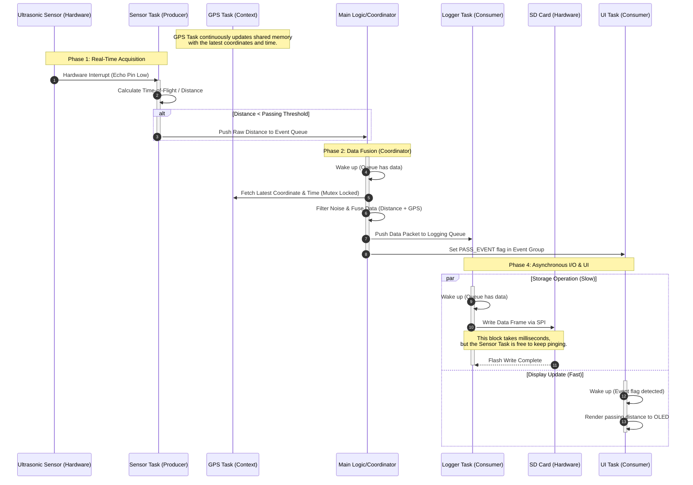

```mermaid
sequenceDiagram
    autonumber
    
    participant HW as Ultrasonic Sensor (Hardware)
    participant ST as Sensor Task (Producer)
    participant GPS as GPS Task (Context)
    participant CT as Main Logic/Coordinator
    participant LT as Logger Task (Consumer)
    participant SD as SD Card (Hardware)
    participant UI as UI Task (Consumer)

    Note over GPS: GPS Task continuously updates shared memory<br>with the latest coordinates and time.

    %% Phase 1: High-Priority Detection
    Note over HW, ST: Phase 1: Real-Time Acquisition
    HW->>ST: Hardware Interrupt (Echo Pin Low)
    activate ST
    ST->>ST: Calculate Time-of-Flight / Distance
    
    alt Distance < Passing Threshold
        ST->>CT: Push Raw Distance to Event Queue
    end
    deactivate ST

    %% Phase 2: Data Fusion
    Note over CT: Phase 2: Data Fusion (Coordinator)
    activate CT
    CT->>CT: Wake up (Queue has data)
    CT->>GPS: Fetch Latest Coordinate & Time (Mutex Locked)
    CT->>CT: Filter Noise & Fuse Data (Distance + GPS)
    
    %% Phase 3: Decoupled Dispatch
    CT->>LT: Push Data Packet to Logging Queue
    CT->>UI: Set PASS_EVENT flag in Event Group
    deactivate CT

    %% Phase 4: Asynchronous Processing
    Note over LT, UI: Phase 4: Asynchronous I/O & UI
    par Storage Operation (Slow)
        activate LT
        LT->>LT: Wake up (Queue has data)
        LT->>SD: Write Data Frame via SPI
        Note over LT, SD: This block takes milliseconds,<br>but the Sensor Task is free to keep pinging.
        SD-->>LT: Flash Write Complete
        deactivate LT
    and Display Update (Fast)
        activate UI
        UI->>UI: Wake up (Event flag detected)
        UI->>UI: Render passing distance to OLED
        deactivate UI
    end
```
